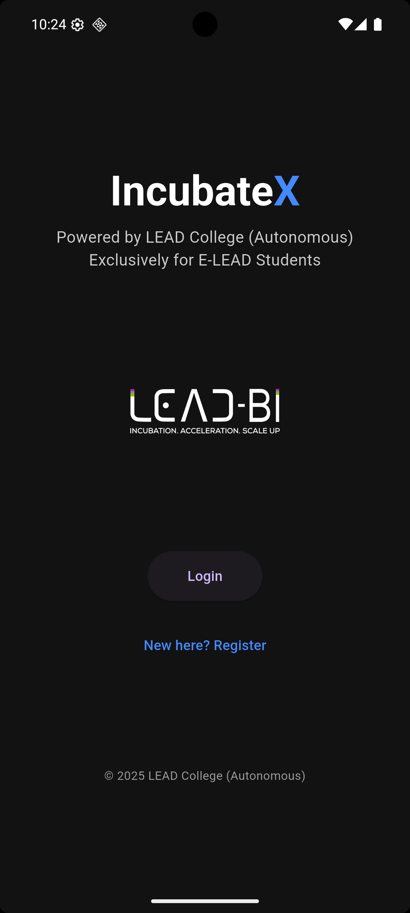

# IncubateX

## Getting Started

This project is a starting point for a Flutter application.

A few resources to get you started if this is your first Flutter project:

- [Lab: Write your first Flutter app](https://docs.flutter.dev/get-started/codelab)
- [Cookbook: Useful Flutter samples](https://docs.flutter.dev/cookbook)

For help getting started with Flutter development, view the
[online documentation](https://docs.flutter.dev/), which offers tutorials,
samples, guidance on mobile development, and a full API reference.

# IncubateX

📊 A **Flutter-based role-driven dashboard system** built to manage and track business incubation progress of student startups at **LEAD College**.

This app is tailored for the **IncubateX incubation program**, ensuring that stakeholders like **students**, **mentors**, **directors**, **deputy directors**, and **admins** can monitor, manage, and support startup growth across different incubation stages.

---

## 🚀 Project Highlights

### 🔑 Core Features
- 🔐 Firebase Authentication & Role Verification
- 🎯 Role-Based Dashboards for:
  - Students (self-tracking)
  - Mentors (assigned mentees)
  - Directors & Deputy Directors (overall progress view)
  - Admins (verification and approval system)
- 📊 Real-time Firestore-based progress tracking
- 📈 Pie chart analysis for stage distribution
- 👤 Profile management (name, email, role, MG ID)
- 🔄 Password reset, logout, and profile viewing

---

## 🧑‍🏫 Roles & Dashboards

### 🎓 Student Dashboard
- View your startup incubation stage
- Profile and personal details
- Submit progress updates (via Firestore)

### 👨‍🏫 Mentor Dashboard
- View mentees whose MG ID matches yours
- Search students by name
- Stage chip indicators for easy tracking

### 👨‍💼 Director & Deputy Director Dashboards
- Overview of all students
- Filter by incubation stage
- Pie chart visualization of startup stages
- Profile modal with student descriptions
- Role-specific profile section with password reset

### 🛡️ Admin Dashboard
- View all student users
- Navigate to student details
- Submission approval (via `/stage_submissions`)
- Admin profile + logout + change password

---

## 💡 Incubation Stages Tracked

- Ideation  
- Idea Validation  
- Prototype  
- Early Traction Stage  
- Scale Up Stage  
- Expansion Stage  
- Completed Your Journey  

---

## 🛠️ Tech Stack

- **Flutter** (Mobile Frontend)
- **Dart**
- **Firebase Auth**
- **Cloud Firestore**
- **FL Chart** (for data visualization)
- **Firebase Storage** (optional - for future use)

---

## 🗃️ Firestore Structure Overview

### 🔐 Collection: `users`
- Fields: `uid`, `name`, `email`, `role`, `stage`, `mgid`, `mentorMgid`, `isVerified`

### 📁 Collection: `stage_submissions`
- Fields: `uid`, `stage`, `description`, `timestamp`, `verified`

---

## 🧰 Setup Guide

### 🔽 1. Clone the Repo
```bash
git clone https://github.com/abhishekalangad/IncubateX.git
cd IncubateX
```
### ⚙️ 2. Install Dependencies

flutter pub get

### 🔗 3. Firebase Setup

Connect your project to Firebase.

Enable Email/Password Authentication

Create users and stage_submissions collections.

Download google-services.json (Android) or GoogleService-Info.plist (iOS)

### ▶️ 4. Run the App

flutter run

### 📷 Screenshots



### 📝 License

This project is built for institutional and educational purposes. Customize licensing as needed.

### 👨‍🎓 Developed By

👨‍💻 Abhishek K - MCA Student, LEAD College

🤖 With support from ChatGPT (Code + Documentation)
